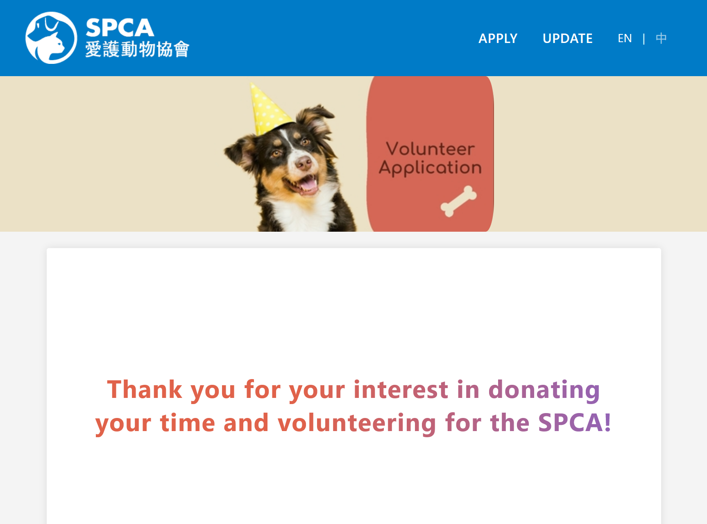

<!-- PROJECT LOGO -->
<br />
<p align="center">
  <a href="https://github.com/hcwtam/spca-forms">
    
  </a>

  <h3 align="center">SPCA Form</h3>

  <p align="center">
    A demo of online form for animal welfare volunteer application.
    <br />
    <br />
    <a href="https://spca-forms.netlify.app/">View Site</a>
    ·
    <a href="https://github.com/hcwtam/spca-forms/issues">Report Bug</a>
    ·
    <a href="https://github.com/hcwtam/spca-forms/issues">Request Feature</a>
  </p>
</p>

## Built With

- [React](https://reactjs.org/)
- [Formik](https://formik.org/)
- [CSS Modules](https://github.com/css-modules/css-modules)

<!-- GETTING STARTED -->

## Getting Started

To get a local copy up and running follow these simple steps.

### Prerequisites

- npm

```sh
npm install npm@latest -g
```

### Installation

1. Clone the repo

```sh
git clone https://github.com/hcwtam/spca-forms
```

2. Install NPM packages

```sh
npm install
```

<!-- CONTACT -->

## Contact

Please feel free to contact me:

Email - [hcwtam@gmail.com](hcwtam@gmail.com)

Project Link: [https://github.com/hcwtam/spca-forms](https://github.com/hcwtam/spca-forms)
